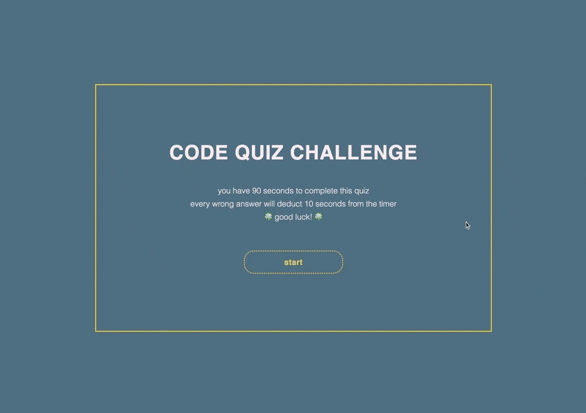

# CODE QUIZ CHALLENGE

## Description
The purpose of this application is to test coding bootcamps on their knowledge of coding, specifically HTML, CSS, and JavaScript. They can then see the list of high scores in the end to compare their progress with that of their peers.

## Installation
N/A

## Usage
To start the quiz, press on the start button. Players have 90 seconds to answer all fifteen questions. Questions are all related to coding (HTML, CSS, JavaScript). If players answer a question correctly, they receive 10 points. If the answer is incorrect, 10 seconds will be deducted from the timer. The quiz ends when the player either answers all questions or if the time has run out.

website link: https://graceee96.github.io/code-quiz

## Credit
Special thanks to AskBCS Learning Assistant

Tutorials referenced:
* How to create a Simple JavaScript Quiz by @jymnjogiya: https://www.geeksforgeeks.org/how-to-create-a-simple-javascript-quiz/

## License
Please refer to LICENSE in the repository.